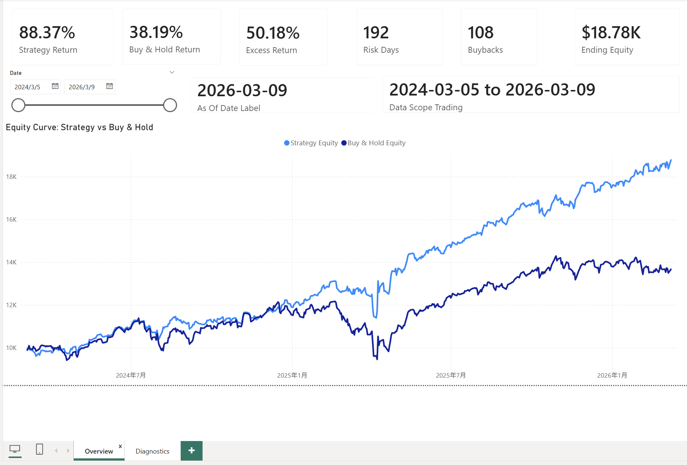
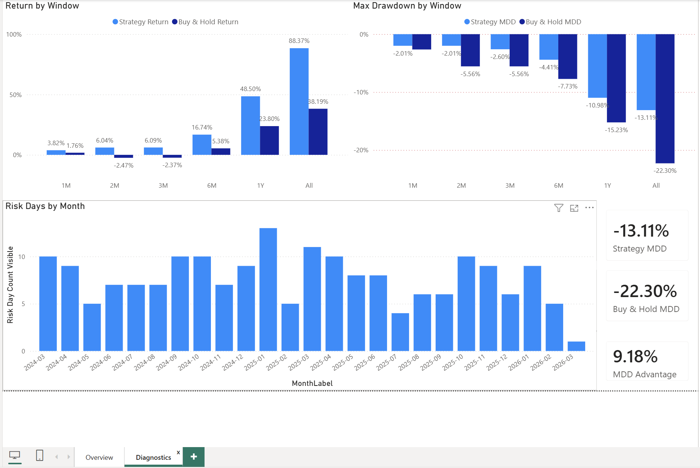

# OS_base Agent (Public)

Python execution framework for a QQQ intraday strategy, with paper trading, backtesting, Telegram notifications, and Windows Task Scheduler integration.

## Tech Stack
- Python
- pandas / numpy
- yfinance
- Telegram Bot API
- Windows Task Scheduler

## Strategy Summary
This project implements an OS_base-style daily workflow:
1. Compute risk-day signal from opening features:
   - `gap = open_930 / prev_close - 1`
   - `early_ret = close_935 / open_930 - 1`
2. Classify risk days using rolling quantile thresholds (default lookback: 252 trading days).
3. Rule-based execution:
   - Morning: evaluate risk day, optional 09:40 de-risking
   - Close: decide buyback vs stay flat
4. Track paper account state (cash, position, equity) and send Telegram updates.

## Reliability Features
- New York timezone normalization (DST-aware)
- Trading-day checks (weekend/holiday skip)
- Late-run guards for morning/close windows
- Persistent state files (`live_day_state`, `paper_state`, `last_close`)
- Split workflows: `run_morning.py` and `run_close.py`
- Runtime config validation before execution

## Project Structure
```text
os_base_agent/
  strategy.py
  live.py
  paper.py
  market_day.py
  history.py
  notify_telegram.py
  tz.py
scripts/
  run_morning.py
  run_close.py
  run_live_agent.py
  backtest_os_base_csv.py
  init_history_from_csv.py
  update_qqq_2year_final.py
```

## Quick Start
```bash
python -m venv .venv
# Windows
.\.venv\Scripts\activate
# macOS/Linux
# source .venv/bin/activate

pip install -r requirements.txt
copy config.example.json config.json
```

Fill `config.json` with your own Telegram token/chat_id if needed.

## Run
```bash
python scripts/run_morning.py --config config.json
python scripts/run_close.py --config config.json
```

Or use Windows Task Scheduler with:
- `run_morning.bat`
- `run_close.bat`

## Tests
```bash
pytest -q
```

## Backtest Reference (Local)
On local 2-year QQQ minute data ending **2026-03-09**:
- Strategy total return: **+88.4%**
- Buy & Hold total return: **+38.2%**
- Strategy max drawdown: **-13.1%**
- Buy & Hold max drawdown: **-22.3%**

These values are environment/data dependent and provided as a reproducible local reference.
## Power BI Dashboard
Built from local backtest outputs generated by the same strategy framework.

- Overview page: KPI cards + equity curve vs buy-and-hold
- Diagnostics page: return by window, drawdown by window, and risk days by month
- Raw local outputs are not published

### Overview


### Diagnostics


## Data Source Note
Live/near-live market data in this repository is pulled from `yfinance` for research/demo use. It is not production-grade market data infrastructure.

## Privacy Notes
This public repo excludes private runtime artifacts by default:
- `data/`, `logs/`, `outputs/`
- `config.json`
- any local secrets/tokens

Use `config.example.json` as template.

## Disclaimer
For research/engineering demonstration only. Not investment advice.

